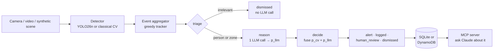
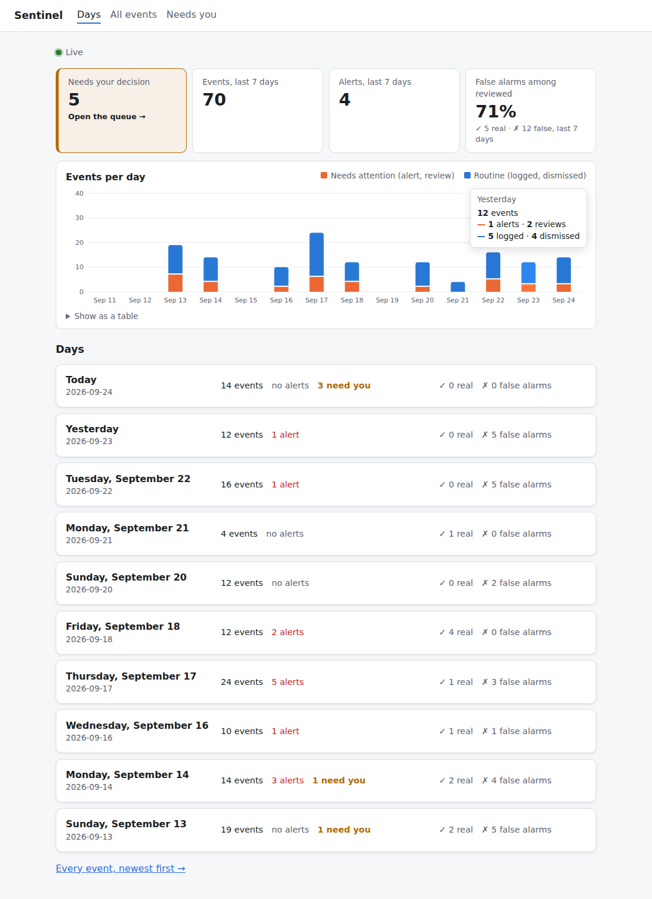
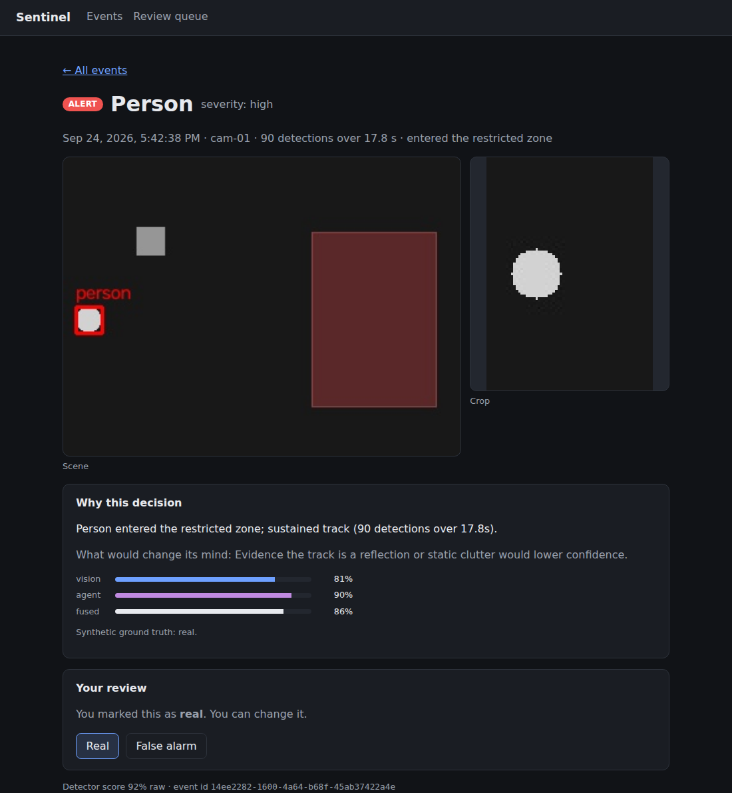

# Sentinel Agent

[](https://github.com/Sahmah/sentinel-agent/actions/workflows/ci.yml)

**A vision detector and an LLM reasoning agent, each giving a confidence score, fused into one decision to escalate or not.**

Sentinel Agent watches a camera (or a synthetic scene), groups detections into events, and
asks a LangGraph agent to reason about each one. The agent never sees the detector's score. The
detector's calibrated probability (`p_cv`) and the agent's own confidence (`p_llm`) are then
combined, and when the two **disagree**, the event goes to a human instead of being guessed.



Runs end to end **with no AWS account and no cost**. The default LLM backend is a transparent
rule-based stand-in, and a single environment variable switches to Claude on Amazon Bedrock.

## Why

Pipelines that pair computer vision with an LLM usually trust one signal and ignore the other.
Recent research (2026) studies uncertainty across multiple agents, but there is no small,
installable library that does the practical version: **calibrate** a detector's score,
**elicit** a confidence from the LLM, **fuse** them, and **route disagreement to a human**.
That is the reusable core here: `sentinel_agent.calibration`, which depends only on numpy and
scikit-learn.

## Quick start

Requires [uv](https://docs.astral.sh/uv/) and Python 3.12+.

```bash
git clone https://github.com/Sahmah/sentinel-agent.git && cd sentinel-agent
uv sync
uv run sentinel demo
```

`sentinel demo` draws a synthetic scene where the ground truth is known: one person crosses a
restricted zone, among decoy shapes built to fool the detector. It fits calibration on 5 other
scenes and runs the full pipeline:

```text
label      time (s)      dets  zone  p_cv  p_llm  severity action
person        0.0-17.8     90  yes   0.84   0.90  high     alert  (real)
object        1.8-2.0       2  yes   0.21   0.28  medium   dismissed  (false positive)
object        5.6-6.0       3  no    0.21    -    -        dismissed  (false positive)
person        6.0-6.0       1  yes   0.72   0.20  medium   human_review  (false positive)
object        9.8-10.4      4  yes   0.21   0.52  medium   human_review  (false positive)
person       13.4-13.6      2  yes   0.42   0.35  medium   human_review  (false positive)
person       14.4-14.4      1  no    0.97   0.20  low      human_review  (false positive)
...
114 detections -> 10 events: 5 dismissed, 4 human_review, 1 alert
Calibration, out of sample (114 detections): ECE 0.191 -> 0.183, Brier 0.174 -> 0.043
```

The one real intrusion is the only alert, and no false positive becomes an alert. Look at the
row at 14.4 s: the detector is 97% sure it saw a person, the agent (which sees a single-frame
track) is 20% sure, so a human decides.

## Live webcam or video

An optional extra adds a real detector, Ultralytics **YOLO26n**, running on CPU:

```bash
uv sync --extra vision
uv run sentinel webcam                      # camera 0, preview window, q to quit
uv run sentinel webcam --source clip.mp4    # a video file
uv run sentinel webcam --zone 0.5,0,0.5,1   # restricted zone = right half of the frame
```

Tested live on a Logitech C270: ~48 ms per frame on a laptop CPU, 5 frames analysed per second
by default. The agent runs in a background thread, so a slow LLM call never freezes the video.
[docs/webcam.md](docs/webcam.md) covers every option, running from Windows when the repo lives
in WSL, and the limitations.

## Ask Claude about what happened (MCP)

Every run saves its decided events: to `sentinel.db` by default, or to DynamoDB with
`SENTINEL_STORAGE_BACKEND=dynamodb`. `sentinel serve-mcp` exposes them over MCP (stdio)
through three read-only tools:

| Tool | What it answers |
| --- | --- |
| `summarize_events` | "How did today go?": counts by decision and label, disagreements, recent alert ids |
| `list_events` | "What happened on the webcam since 10:00?": newest first, filters, cursor pagination |
| `get_event` | "Why was this one sent to a human?": the full record, with the agent's reasoning |

The repo ships a `.mcp.json`, so after `uv run sentinel demo`, opening Claude Code in the repo
is enough. Approve the `sentinel` server and ask:

```text
> Summarize the last Sentinel run. Which events went to human review, and why?
```

| Variable | Default | Meaning |
| --- | --- | --- |
| `SENTINEL_STORAGE_BACKEND` | `sqlite` | `sqlite` or `dynamodb` |
| `SENTINEL_DB_PATH` | `sentinel.db` | SQLite file |
| `SENTINEL_DYNAMODB_TABLE` | `sentinel-events` | Table with an `id` key and a `by_time` GSI (`kind`, `occurred_at`); see `storage/dynamodb_store.py` |

Pass `--no-store` to `demo` or `webcam` to skip saving.

## Dashboard

```bash
cd frontend && npm install && npm run build && cd ..
uv run sentinel serve             # http://127.0.0.1:8000
```

<p align="center">
  
  
</p>

A Svelte 5 dashboard over the same event store: summary, filters and a review queue, a live
feed (new events arrive over Server-Sent Events while `sentinel webcam` runs), and for each
event the scene, the crop, the agent's reasoning and the three confidences (vision, agent,
fused). The **Real** / **False alarm** buttons record a person's verdict; once a camera has
five of each, `sentinel webcam` calibrates its `p_cv` on them, which is the live version of
the calibration the demo does with synthetic ground truth. Desktop notifications fire for
live alerts and review requests after an explicit opt-in. See
[frontend/README.md](frontend/README.md); the API is `src/sentinel_agent/api.py`
(localhost only: it serves camera images and has no auth).

## Using Claude on Bedrock

```bash
export SENTINEL_LLM_BACKEND=bedrock
export SENTINEL_BEDROCK_MODEL_ID=...   # optional; some regions need a "us." inference profile id
uv run sentinel demo                   # uses your normal AWS credentials
```

The demo backend and Bedrock receive the same prompt and go through the same parser, graph
and fusion code. The LLM is injected into `build_graph(llm)`, so tests use a fake model and
never touch the network.

## A free local LLM (Ollama), and how to grade any LLM

```bash
uv sync --extra ollama
export SENTINEL_LLM_BACKEND=ollama          # SENTINEL_OLLAMA_MODEL=gemma3:4b by default
uv run sentinel eval-llm --seeds 1-5        # grade it on synthetic ground truth
```

Running Ollama on Windows (for the GPU) and Sentinel in WSL? On Windows 11, WSL's mirrored
networking makes `localhost` work. On Windows 10, have Ollama listen with
`OLLAMA_HOST=0.0.0.0:11434`, allow port 11434 only from the WSL network (172.16.0.0/12) in the
firewall, and point Sentinel at the Windows host:
`export SENTINEL_OLLAMA_URL="http://$(ip route show default | awk '{print $3}'):11434"`.
Ollama has no authentication, so keep that firewall rule narrow.

`sentinel eval-llm` runs the agent on every event of a few synthetic scenes, which know which
events are real, and reports whether `p_llm` separates real events from detector artifacts
(AUROC), whether it is calibrated (ECE, Brier) and what the pipeline then decided. It is how
prompt changes are judged here: with numbers, on 38 events (7 real).

| Backend and prompt | AUROC | ECE | Brier | Real alerted | False alerts | To a human |
| --- | --- | --- | --- | --- | --- | --- |
| Demo rules (baseline) | 1.000 | 0.327 | 0.138 | 7/7 | 0 | 22 |
| gemma3:4b, prompt v1 | **0.240** | 0.551 | 0.493 | **0/7** | 0 | 0 |
| gemma3:4b, prompt v2 | 1.000 | 0.441 | 0.262 | 7/7 | 0 | 7 |
| gemma3:4b, prompt v3 (current) | 1.000 | 0.362 | 0.193 | 7/7 | 0 | 14 |
| gemma3:4b, prompt v3 + review memory | 1.000 | **0.293** | **0.129** | 7/7 | 0 | 21 |

With the first prompt, the 4B model read "90 detections" as a sign of an artifact and scored
worse than chance. Explaining what the evidence means (about 5 frames per second, artifacts
flicker for one to a few frames) fixed the ranking; saying that one- or two-frame tracks are
probably artifacts improved calibration. The rise in human reviews is the design working: once
the model is unsure about flickers, it disagrees with a detector that is sure, and
disagreement goes to a person. gemma3:4b took about 8 s per event on an 8 GB AMD RX 580
(Vulkan). Note what this does and does not show: from metadata alone, an LLM can at best
match the rules. Its real advantage should come from seeing the snapshot.

### Learning from reviews: the agent's memory

Every verdict a person gives in the dashboard becomes an example. Before the agent reasons about
a new event, it is shown the most similar events from the same camera that someone already
reviewed (same label, same side of the zone, a track of similar length), with the verdict and,
when vision is on, their crops. A "dog" that was marked a false alarm twice makes the next
similar "dog" less credible. Nothing is trained: it is retrieval into the prompt, it applies
from the first review, and reviews made during a webcam run are picked up within a minute. It is
on by default; `SENTINEL_LLM_MEMORY=0` turns it off.

`sentinel eval-llm --memory 5` measures it, with the ground truth of five other synthetic scenes
standing in for reviews. On gemma3:4b it lowered ECE from 0.362 to 0.293 and Brier from 0.193 to
0.129 (row above), mostly by making the model less confident about flickers; the extra human
reviews come from the agent now disagreeing more often with a confident detector.

### Letting the agent see the snapshot

```bash
export SENTINEL_LLM_VISION=1   # the reasoning prompt now carries the event's crop
```

With vision on, each event's crop is attached to the prompt as a standard image block (Ollama
and Bedrock both accept it), and the prompt asks the model to say what the image shows and to
lower its confidence if it is not the labelled object. On a test clip, gemma3:4b described the
crops correctly ("a person standing near a bus") but still judged a 20-detection, 3.8 s track
as "brief" and gave a person inside the zone low severity. The plumbing works; a 4B model's
judgement is the limit, and a larger model is the next thing to try. Two caveats:
`eval-llm` ignores vision (the synthetic targets are drawn circles, which a model that can see
would rightly doubt), so grading vision needs real footage with human reviews, which the
dashboard collects; and seeing the same pixels as the detector makes the two signals somewhat
less independent (the model still never sees the detector's score).

## How it works

| Stage | Module | What it does |
| --- | --- | --- |
| Detect | `detection/` | `Detector` protocol with two implementations: a classical OpenCV contour detector (for the synthetic scene) and YOLO26n (for real video) |
| Aggregate | `events/` | Greedy tracker that groups detections into events by time gap and center distance. A streaming version closes each event once its object has been gone for `--gap` seconds |
| Triage | `agent/graph.py` | Cheap filter: non-person objects outside the zone never cost an LLM call. On live video, neither do one-frame person flickers outside the zone |
| Reason | `agent/` | One LLM call returns JSON with `severity`, `reasoning`, `confidence` and `confidence_basis`. If the reply can't be parsed twice, the event goes to `human_review` |
| Decide | `calibration/fusion.py` | Weighted fusion of `p_cv` and `p_llm`. A gap above 0.35 counts as disagreement and goes to a human; low combined confidence is dismissed |
| Snapshot | `snapshots.py` | When an event closes, a crop around its most confident detection (`<id>.jpg`) and the full frame with the box (`<id>_scene.jpg`) are saved to `snapshots/` |
| Serve (HTTP) | `api.py` | Starlette API for the dashboard: events, summary, snapshots, an SSE stream of new events, and human review |
| Store | `storage/` | One flat record per decided event. SQLite (keyset pagination) or DynamoDB (time-ordered GSI), behind the same `Storage` protocol |
| Serve | `mcp_server/` | Tool logic as plain functions over `Storage`; `MCPServer` only adds schemas. Expected failures raise `ToolError`, anything else is masked |
| Calibrate | `calibration/` | Platt scaling, isotonic regression, temperature scaling, self-consistency, ECE and Brier score |

## Honest limitations

These are part of the point of the project, not fine print.

- **Calibration can't fix a score that doesn't separate the cases.** On a larger evaluation
  (fit on 10 scenes, tested on 10 others, 1,144 detections), Platt scaling **improves Brier**
  (0.180 → 0.110) but **worsens ECE** (0.128 → 0.213). The classical detector's raw score isn't
  monotonic in correctness: true targets score around 0.916, while decoys score from 0.893 up
  to 0.929. A monotonic calibrator can't untangle that. The second signal, the agent looking at
  track length, is what separates them. It is also why you should track ECE and Brier together.
- **Live `p_cv` is uncalibrated.** A webcam has no ground truth, so `p_cv` is YOLO's raw
  confidence (marked `*` in the output). A real deployment would fit a calibrator on a
  human-reviewed history of that camera.
- **The fusion is deliberately simple.** It treats the two signals as independent evidence.
  That is a smaller stretch with one detector and one agent than with a swarm, but it is still
  an assumption.
- **The tracker is minimal.** Two people crossing each other can swap or merge events; a real
  tracker (e.g. ByteTrack) would fix that.
- **The demo "LLM" is rules.** It only sees what the real model would see, and exists so the
  pipeline is reproducible at zero cost.

## AWS infrastructure

[`infra/`](infra/README.md) is the Terraform for the AWS path: the DynamoDB table, a
least-privilege role (Bedrock invoke on one inference profile, three DynamoDB calls, no
wildcards), and an optional budget alert. `terraform test` checks it offline against a mocked
provider; applying it is left to you, because it creates billable resources.

## Development

```bash
uv run pytest                                  # 125 tests, no network, no AWS
uv run ruff check . && uv run ruff format --check .
cd frontend && npm run check && npm test          # dashboard
cd infra && terraform test                         # infrastructure, offline
```

CI runs all three on every push and pull request. Dependabot opens weekly grouped updates for
the Python, npm, Terraform and GitHub Actions dependencies.

### Reports and local test runs

Each `sentinel demo` and `sentinel webcam` run ends by writing a Markdown report of that run to
`lab/reports/`: counts by decision, the events that still need a person, and every event with
its crop, confidences and reasoning. `sentinel report --hours 24` writes one for any period,
and `sentinel eval-llm` keeps each run's scores in `lab/evals/` so prompt and model changes
can be compared. `lab/` is ignored by git: it is the place for local experiments.

### Releases

Bump `version` in `pyproject.toml`, commit, then tag and push:

```bash
git tag v0.2.0 && git push origin v0.2.0
```

The Release workflow reruns the full CI, builds the dashboard, bundles it into the Python
package, installs the wheel on its own to check that `sentinel serve` answers, and publishes a
GitHub Release with the wheel, the sdist and the dashboard as a zip. With the wheel alone,
`uv tool install sentinel_agent-<version>-py3-none-any.whl` gives you `sentinel serve` with the
dashboard, no Node needed. Running the workflow by hand (Actions > Release) is a dry run: it
builds and uploads the files as an artifact but publishes nothing. Claude Code users get the project's skills in
`.claude/skills/` (including do/don't rules for the Svelte dashboard) and two MCP servers from
`.mcp.json`: this project's event store and the official Svelte docs/autofixer.

Tests use `hypothesis` for aggregator and calibration invariants, `GenericFakeChatModel`
for the graph nodes, moto for DynamoDB (the same storage tests run against both backends), and
an in-memory MCP client for the server. The YOLO tests use a fake model, so they don't need torch; one test with
the real model runs only when the `vision` extra and the weights are installed.

## Roadmap

- [x] Synthetic scene, classical detector, event aggregation, calibration library
- [x] LangGraph agent (demo and Bedrock backends) with confidence fusion
- [x] Live webcam / video mode with YOLO26n
- [x] Event storage: SQLite by default, DynamoDB optional
- [x] MCP server (`sentinel serve-mcp`) to query past events and alerts from Claude
- [x] Local LLM backend (Ollama) and `sentinel eval-llm`
- [x] Event snapshots (crop + scene)
- [x] Vision LLM: send the snapshot to the reasoning model (`SENTINEL_LLM_VISION=1`)
- [x] HTTP API, live dashboard (Svelte), desktop notifications, human review
- [x] Webcam confidence calibrated on human reviews
- [x] Review memory: similar reviewed events shown to the agent as examples
- [ ] Grade vision and memory on reviewed real footage (`eval-reviews`)
- [ ] Fine-tune YOLO on reviewed crops (pre-label, check in Label Studio, train)
- [ ] Phone notifications (Telegram or self-hosted ntfy)
- [x] Terraform for the AWS path (least-privilege IAM, Bedrock, DynamoDB), tested offline
- [x] GitHub Actions CI (Python, dashboard, Terraform)

## License

[MIT](LICENSE), for the code in this repository.

The optional `vision` extra installs Ultralytics YOLO, which is **AGPL-3.0**. If you install
and use it, your project falls under AGPL-3.0 unless you hold an Ultralytics Enterprise
license. The default install (synthetic demo, calibration library, agent) does not depend on
it, and [RF-DETR](https://github.com/roboflow/rf-detr) (Apache 2.0) could replace it through
the same `Detector` protocol.
