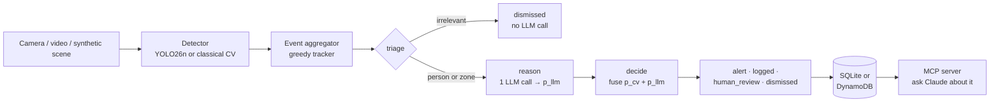

# Sentinel Agent

**A vision detector and an LLM reasoning agent, each giving a confidence score, fused into one decision to escalate or not.**

Sentinel Agent watches a camera (or a synthetic scene), groups detections into events, and
asks a LangGraph agent to reason about each one. The agent never sees the detector's score. The
detector's calibrated probability (`p_cv`) and the agent's own confidence (`p_llm`) are then
combined, and when the two **disagree**, the event goes to a human instead of being guessed.



Runs end to end **with no AWS account and no cost**. The default LLM backend is a transparent
rule-based stand-in, and a single environment variable switches to Claude on Amazon Bedrock.

## Why

Pipelines that pair computer vision with an LLM usually trust one signal and ignore the other.
Recent research (2026) studies uncertainty across multiple agents, but there is no small,
installable library that does the practical version: **calibrate** a detector's score,
**elicit** a confidence from the LLM, **fuse** them, and **route disagreement to a human**.
That is the reusable core here: `sentinel_agent.calibration`, which depends only on numpy and
scikit-learn.

## Quick start

Requires [uv](https://docs.astral.sh/uv/) and Python 3.12+.

```bash
git clone https://github.com/Sahmah/sentinel-agent.git && cd sentinel-agent
uv sync
uv run sentinel demo
```

`sentinel demo` draws a synthetic scene where the ground truth is known: one person crosses a
restricted zone, among decoy shapes built to fool the detector. It fits calibration on 5 other
scenes and runs the full pipeline:

```text
label      time (s)      dets  zone  p_cv  p_llm  severity action
person        0.0-17.8     90  yes   0.84   0.90  high     alert  (real)
object        1.8-2.0       2  yes   0.21   0.28  medium   dismissed  (false positive)
object        5.6-6.0       3  no    0.21    -    -        dismissed  (false positive)
person        6.0-6.0       1  yes   0.72   0.20  medium   human_review  (false positive)
object        9.8-10.4      4  yes   0.21   0.52  medium   human_review  (false positive)
person       13.4-13.6      2  yes   0.42   0.35  medium   human_review  (false positive)
person       14.4-14.4      1  no    0.97   0.20  low      human_review  (false positive)
...
114 detections -> 10 events: 5 dismissed, 4 human_review, 1 alert
Calibration, out of sample (114 detections): ECE 0.191 -> 0.183, Brier 0.174 -> 0.043
```

The one real intrusion is the only alert, and no false positive becomes an alert. Look at the
row at 14.4 s: the detector is 97% sure it saw a person, the agent (which sees a single-frame
track) is 20% sure, so a human decides.

## Live webcam or video

An optional extra adds a real detector, Ultralytics **YOLO26n**, running on CPU:

```bash
uv sync --extra vision
uv run sentinel webcam                      # camera 0, preview window, q to quit
uv run sentinel webcam --source clip.mp4    # a video file
uv run sentinel webcam --zone 0.5,0,0.5,1   # restricted zone = right half of the frame
```

Tested live on a Logitech C270: ~48 ms per frame on a laptop CPU, 5 frames analysed per second
by default. The agent runs in a background thread, so a slow LLM call never freezes the video.
[docs/webcam.md](docs/webcam.md) covers every option, running from Windows when the repo lives
in WSL, and the limitations.

## Ask Claude about what happened (MCP)

Every run saves its decided events: to `sentinel.db` by default, or to DynamoDB with
`SENTINEL_STORAGE_BACKEND=dynamodb`. `sentinel serve-mcp` exposes them over MCP (stdio)
through three read-only tools:

| Tool | What it answers |
| --- | --- |
| `summarize_events` | "How did today go?": counts by decision and label, disagreements, recent alert ids |
| `list_events` | "What happened on the webcam since 10:00?": newest first, filters, cursor pagination |
| `get_event` | "Why was this one sent to a human?": the full record, with the agent's reasoning |

The repo ships a `.mcp.json`, so after `uv run sentinel demo`, opening Claude Code in the repo
is enough. Approve the `sentinel` server and ask:

```text
> Summarize the last Sentinel run. Which events went to human review, and why?
```

| Variable | Default | Meaning |
| --- | --- | --- |
| `SENTINEL_STORAGE_BACKEND` | `sqlite` | `sqlite` or `dynamodb` |
| `SENTINEL_DB_PATH` | `sentinel.db` | SQLite file |
| `SENTINEL_DYNAMODB_TABLE` | `sentinel-events` | Table with an `id` key and a `by_time` GSI (`kind`, `occurred_at`); see `storage/dynamodb_store.py` |

Pass `--no-store` to `demo` or `webcam` to skip saving.

## Using Claude on Bedrock

```bash
export SENTINEL_LLM_BACKEND=bedrock
export SENTINEL_BEDROCK_MODEL_ID=...   # optional; some regions need a "us." inference profile id
uv run sentinel demo                   # uses your normal AWS credentials
```

The demo backend and Bedrock receive the same prompt and go through the same parser, graph
and fusion code. The LLM is injected into `build_graph(llm)`, so tests use a fake model and
never touch the network.

## How it works

| Stage | Module | What it does |
| --- | --- | --- |
| Detect | `detection/` | `Detector` protocol with two implementations: a classical OpenCV contour detector (for the synthetic scene) and YOLO26n (for real video) |
| Aggregate | `events/` | Greedy tracker that groups detections into events by time gap and center distance. A streaming version closes each event once its object has been gone for `--gap` seconds |
| Triage | `agent/graph.py` | Cheap filter: non-person objects outside the zone never cost an LLM call. On live video, neither do one-frame person flickers outside the zone |
| Reason | `agent/` | One LLM call returns JSON with `severity`, `reasoning`, `confidence` and `confidence_basis`. If the reply can't be parsed twice, the event goes to `human_review` |
| Decide | `calibration/fusion.py` | Weighted fusion of `p_cv` and `p_llm`. A gap above 0.35 counts as disagreement and goes to a human; low combined confidence is dismissed |
| Store | `storage/` | One flat record per decided event. SQLite (keyset pagination) or DynamoDB (time-ordered GSI), behind the same `Storage` protocol |
| Serve | `mcp_server/` | Tool logic as plain functions over `Storage`; `MCPServer` only adds schemas. Expected failures raise `ToolError`, anything else is masked |
| Calibrate | `calibration/` | Platt scaling, isotonic regression, temperature scaling, self-consistency, ECE and Brier score |

## Honest limitations

These are part of the point of the project, not fine print.

- **Calibration can't fix a score that doesn't separate the cases.** On a larger evaluation
  (fit on 10 scenes, tested on 10 others, 1,144 detections), Platt scaling **improves Brier**
  (0.180 → 0.110) but **worsens ECE** (0.128 → 0.213). The classical detector's raw score isn't
  monotonic in correctness: true targets score around 0.916, while decoys score from 0.893 up
  to 0.929. A monotonic calibrator can't untangle that. The second signal, the agent looking at
  track length, is what separates them. It is also why you should track ECE and Brier together.
- **Live `p_cv` is uncalibrated.** A webcam has no ground truth, so `p_cv` is YOLO's raw
  confidence (marked `*` in the output). A real deployment would fit a calibrator on a
  human-reviewed history of that camera.
- **The fusion is deliberately simple.** It treats the two signals as independent evidence.
  That is a smaller stretch with one detector and one agent than with a swarm, but it is still
  an assumption.
- **The tracker is minimal.** Two people crossing each other can swap or merge events; a real
  tracker (e.g. ByteTrack) would fix that.
- **The demo "LLM" is rules.** It only sees what the real model would see, and exists so the
  pipeline is reproducible at zero cost.

## Development

```bash
uv run pytest                                  # 91 tests, no network, no AWS
uv run ruff check . && uv run ruff format --check .
```

Tests use `hypothesis` for aggregator and calibration invariants, `GenericFakeChatModel`
for the graph nodes, moto for DynamoDB (the same storage tests run against both backends), and
an in-memory MCP client for the server. The YOLO tests use a fake model, so they don't need torch; one test with
the real model runs only when the `vision` extra and the weights are installed.

## Roadmap

- [x] Synthetic scene, classical detector, event aggregation, calibration library
- [x] LangGraph agent (demo and Bedrock backends) with confidence fusion
- [x] Live webcam / video mode with YOLO26n
- [x] Event storage: SQLite by default, DynamoDB optional
- [x] MCP server (`sentinel serve-mcp`) to query past events and alerts from Claude
- [ ] Terraform for the AWS path (least-privilege IAM, Bedrock, DynamoDB, S3)
- [ ] GitHub Actions CI

## License

[MIT](LICENSE), for the code in this repository.

The optional `vision` extra installs Ultralytics YOLO, which is **AGPL-3.0**. If you install
and use it, your project falls under AGPL-3.0 unless you hold an Ultralytics Enterprise
license. The default install (synthetic demo, calibration library, agent) does not depend on
it, and [RF-DETR](https://github.com/roboflow/rf-detr) (Apache 2.0) could replace it through
the same `Detector` protocol.
